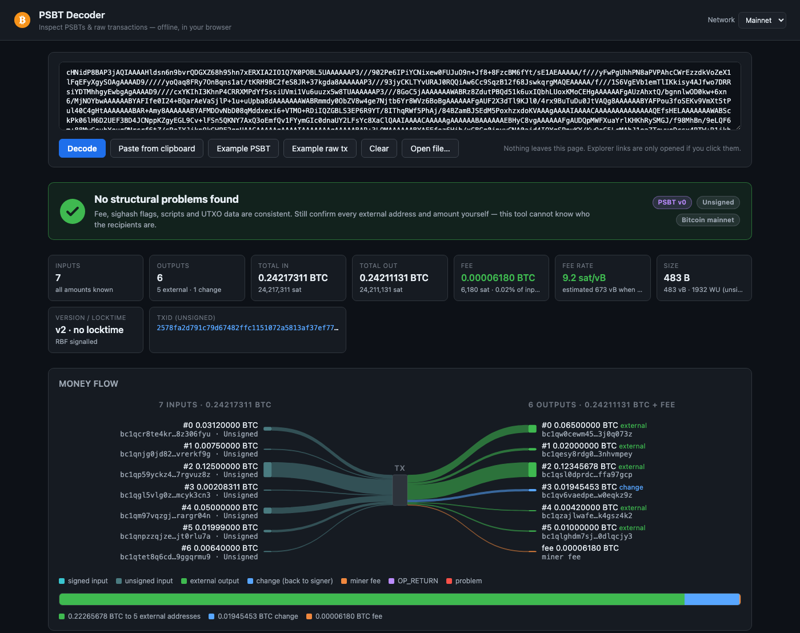

# PSBT Decoder

**Live: https://objsal.github.io/psbt-decoder/**



A single-page, dependency-free web app that decodes **PSBTs** (BIP174 v0 and BIP370 v2) and **raw Bitcoin transactions**, shows every detail visually, disassembles the scripts, and runs a set of security checks so you can decide whether a transaction is safe to sign.

Everything runs client-side in the browser. No build step, no network requests — open `index.html` and paste.

## Features

- **Input formats**: PSBT as base64 or hex, raw transaction hex, or drop a binary `.psbt` file. Auto-detected.
- **Verdict banner** – *safe / review / do not sign* – plus signing status (unsigned, partially signed, fully signed, finalized).
- **Money-flow diagram** (Sankey-style SVG): inputs → tx → outputs with ribbons proportional to value, colour-coded as signed/unsigned input, external output, change, miner fee, OP_RETURN and problems. Hover for details.
- **Stats**: totals, fee, fee rate (actual for signed, estimated for unsigned), size / vsize / weight, version, locktime, RBF, txid.
- **Input amounts for raw transactions**: a raw tx only references its inputs by `txid:vout`, so the fee cannot be computed from it alone. An *Input amounts* panel appears whenever amounts are missing and lets you paste the previous transactions (resolved offline) or, on an explicit click, fetch them from mempool.space. Fee, verdict and spend types are recomputed.
- **Security checks**:
  - fee sanity (absurd fee, zero fee, < 1 sat/vB), outputs exceeding inputs
  - missing `witness_utxo` / `non_witness_utxo` (fee cannot be verified)
  - `non_witness_utxo` txid mismatch, witness_utxo/non_witness_utxo disagreement
  - `redeem_script` / `witness_script` hash mismatch against the scriptPubKey
  - dangerous sighash flags (`SIGHASH_NONE`, `SINGLE`, `ANYONECANPAY`) declared or found in signatures
  - change detection via BIP32 derivation / master fingerprints; external outputs to verify
  - dust outputs, OP_RETURN burns, non-standard scripts, duplicate inputs, address reuse
  - RBF signalling, locktime interpretation, unknown / proprietary fields
- **Inputs / outputs cards** with outpoint, amount, address, spend type (P2PKH, P2SH-P2WPKH, P2WSH multisig m-of-n, P2TR key/script path…), sequence decoding, signatures with sighash, derivation paths, taproot fields.
- **Script disassembly** with colour-coded opcode / pubkey / signature / hash chips, plain-language classification (e.g. "2-of-3 multisig", "relative timelock (CSV)").
- **Annotated hex** view: every byte of the PSBT / transaction coloured by field; hover or click to see what it is.
- **PSBT fields** table (raw key/value maps) and a **JSON** export; finalized PSBTs get the extracted transaction hex + txid.
- Mainnet / testnet / signet / regtest address encoding.

## Usage

Open `index.html` directly, or serve the folder:

```sh
python3 -m http.server 8080
# → http://localhost:8080
```

Paste a PSBT / transaction and press **Decode** (or ⌘/Ctrl+Enter). "Example PSBT" / "Example raw tx" load a bundled synthetic 7-in / 6-out transaction (generated by `test/gen_example.py` from the public BIP39 test mnemonic). You can also pass data in the URL: `index.html?psbt=<base64>` or `index.html#<hex>`.

## Security notes

- The app never sends data anywhere on its own. The only network access is the optional **Fetch from mempool.space** button (which reveals the input txids of the transaction you are inspecting) and explorer links, both only on your click.
- "No structural problems found" means the data is internally consistent — it can **not** tell you whether the external addresses are the ones you intend to pay. Always verify destinations and amounts yourself.
- A raw (non-PSBT) transaction carries no UTXO information, so the fee and change cannot be verified from it alone — supply the previous transactions via the Input amounts panel.

## Tests

```sh
node test/test-crypto.js     # SHA-256 / RIPEMD-160 / base58 / bech32 vectors
node test/test-tx.js         # raw tx parsing, txid, round-trip
node test/test-psbt.js       # PSBT construction / parsing / analysis
node test/test-fixtures.js   # fixtures generated with embit (signed, multisig, taproot, traps)
python3 test/gen_psbts.py    # regenerate test/fixtures.json (requires `pip install embit`)
python3 test/gen_example.py  # regenerate the bundled demo data
```

## Layout

```
index.html        page
css/style.css     styles
js/crypto.js      SHA-256, RIPEMD-160 (pure JS)
js/bytes.js       hex/base64, varints, byte reader with segment recording
js/encoding.js    base58check, bech32/bech32m, BIP32 helpers
js/script.js      opcodes, disassembler, script classification, addresses
js/tx.js          raw transaction parser / serializer
js/psbt.js        PSBT v0/v2 parser + normalized model
js/analysis.js    security checks and verdict
js/ui.js          rendering (flow diagram, cards, annotated hex, JSON)
js/app.js         wiring
```

## License

MIT
